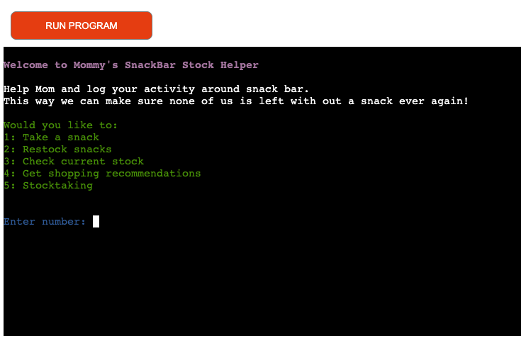

# MOMMYS SNACKBAR HELPER SYSTEM
  - [OVERVIEW](#overview)
  - [UX/UI](#uxui)
    - [STRATEGY](#strategy)
      - [Goals ](#goals)
      - [User Stories ](#user-stories)
    - [SCOPE ](#scope)
    - [STRUCTURE ](#structure)
    - [FLOWCHARTS ](#flowcharts)
  - [FEATURES](#features)
    - [EXISTING FEATURES ](#existing-features)
    - [FUTURE FEATURES ](#future-features)
  - [BUGS OR ERRORS](#bugs-or-errors)
  - [TESTING](#testing)
  - [MODULES IMPORTED](#modules-imported)
  - [DEPLOYMENT](#deployment)
    - [CREATING THE WEBSITE](#creating-the-website)
    - [DEPLOYING ON HEROKU](#deploying-on-heroku)
    - [FORK THE REPOSITORY](#fork-the-repository)
    - [CLONE THE REPOSITORY](#clone-the-repository)
  - [CREDITS](#credits)
  - [TOOLS](#tools)
  - [ACKNOWLEDGEMENTS](#acknowledgements)
## OVERVIEW
I created a snackbar stockkeeping system for a busy mom. It helps to stay on track of the consumption of the snacks individually, it reacts to changes in consumption and offers restocking recommendations based on previous restockings and consumption. The user can log a consumption, restock items, check current stock and reset the system by performing stockkeeping action.
  
Click [HERE](https://mommys-snackbar-helper-264f000fb5c5.herokuapp.com/) to access the fully deployed project. 

## UX/UI
### STRATEGY
#### Goals 
* The program should be easy and fast to use 
* The instructions should be easy to follow 
* Instructions should clearly indicate what values needs to be entered 
* The information colourcoded for easy readability 
* The program should access the right data sheet in every step  
* The program should update the data sheets with the right values 
* The information pulled from the datasheet should be correct 
* The information offered to the user should be clearly formatted 
* The program should have the option to reset the values (Stockkeeping)

#### User Stories 
* User wants to insert information as simply as possible 
* User wants the program to be usable as soon as a child can read 
* User wants to be able to see current stock 
* User wants to be able to take and add multiple items 
* User wants to get recommendations for restocking 
* User wants to perform stocktaking regularly 

### SCOPE 
To be able to accommodate the needs I have planned the following features: 

* The option to log any usage of snack items 
* The option to log restocks 
* The option of displaying current stock  
* The program calculates recommendations based on usage and previous restock values 
* The option of performing stocktaking measures 
* The program displays warnings when the input are not in line with expected answers 

### STRUCTURE 
The ordering system can be used by the client through a mock terminal that appears when the link is accessed.
The terminal was created using the Code Institute template found [HERE](https://github.com/Code-Institute-Org/p3-template)
The program was made using Python as the programming language. The entire code can be found from run.py file.
Heroku is running the program

### FLOWCHARTS 
INSERT FLOWCHART

## FEATURES
### EXISTING FEATURES 
The program has multiple features to help the mom to stay on track with snacks. The system is linked to a Google Spreedsheet that can be accessed [here](https://docs.google.com/spreadsheets/d/1V5KxuSG989F_jIA8baz2xVtmK4HBiJFcZXgDuEIHiJA/edit?usp=sharing). 

* The program will push the values to the spreadsheet every time valid information is provided  

* Validation features give the user feedback if uncorrect values are provided. 

* The user has a possibility to check current stock at any point 

* User can reset the system by using stocktaking feature 

### FUTURE FEATURES 
* Create a possibility to add and change snacks.
* Update the recommendation feature to consider when goods were consumed so you could ask for a weeks worth of items. 
* Possibility to scan items in and out of stock using bar codes

## BUGS OR ERRORS
* During the development of the project I encountered a problem whit restock feature.
* While building the project and testing the values pushed to the spreadsheet I realized that restocking value 0 was causing the recommendations to always say "enough stock". I fixed this by exsempting 0 from the push of information. This way the last restock is always a positive number. 

## TESTING
IMPORT TESTING

## MODULES IMPORTED
* <b>google.oauth2.service_account</b> for using the<code> Credentials </code> function on "creds.json" file that was used to link the program with the Google spreadsheet using the <b>gspread</b> module
* <b>os</b> module was imported for accessing <code>os.system</code> to clear the terminal
* From <b>colorama</b> module I imported <code>Fore, Back, Style</code> for printing text in different colors

## DEPLOYMENT
### CREATING THE WEBSITE
I have used the [Code Institute Python Essentials Template](https://github.com/Code-Institute-Org/python-essentials-template) for creating a terminal where my Python code will generate its output.
The steps were as follows:
  
### DEPLOYING ON HEROKU
After finishing developing the program I deployed it on <b>Heroku</b> following the instructions:
- Create an account and login into [Heroku](https://id.heroku.com/login) website
- Click "New -> Create new app" button
- Insert your app's Name and Choose your region then click the "Create App" button
- Into the Settings tab go to "Config vars" section and click "Reveal Config Vars"
- Enter the PORT in the KEY section and 8000 for its value, then click "Add" 
- Go to "Buildpacks" section and click "Add buildpack"
- Firstly add the Python buildpack then NodeJs
- Into the Deploy tab go to -Deployment method- and select Github
- After that go to "App connected to GitHub" and look for your GitHub repository name to link it
- I chose to automatically deploy the app to Heroku.
- When the deploying is finished, a link will be provided to you for accessing your app

### FORK THE REPOSITORY 
For creating a copy of the repository on your account and change it without affecting the original project please use Fork
- On [My Repository Page](https://github.com/useriasminna/american_pizza_order_system), press <i>Fork</i> in the top right of the page
- A forked version of my project will appear in your own repository  

### CLONE THE REPOSITORY
For creating a clone of the repository on your local machine, use<b>Clone</b>:
- On [My Repository Page](https://github.com/JuttaAliisa/MommysSnackBar), click the <i>Code</i> green button, right above the code window
- Chose from <i>HTTPS, SSH and GitClub CLI</i> format and copy
- In your <i>IDE</i> open <i>Git Bash</i>
- Enter the command <code>git clone</code> followed by the copied URL
- Your clone was created

## CREDITS
* The code for linking to the Google Spreadsheet and manipulating it was taken and adapted from the Code Institute Love Sandwiches tutorial
* The code for clearing the terminal was taken from [stackoverflow](https://stackoverflow.com/questions/2084508/clear-terminal-in-python)
* Instructions and inspiration (but no direct copy of the code) has been searched from https://stackoverflow.com/ and https://www.w3schools.com/ together with Code Institute tutorials from full stack development course.
  

## TOOLS
[GitHub](https://github.com/) - used for hosting the source code of the program 
[Gitpod Dev Environment](https://gitpod.io/) - used for testing the program 
[pycodestyle validator](https://pycodestyle.pycqa.org/en/latest/intro.html#id5) - used for validating the python code 
[Heroku](https://dashboard.heroku.com/) - used for deploying the project 
[HTML - W3C HTML Validator](https://validator.w3.org/#validate_by_uri+with_options) - used for validating the HTML 
[CSS - Jigsaw CSS Validator](https://jigsaw.w3.org/css-validator/#validate_by_uri) - used for validating the CSS 

## ACKNOWLEDGEMENTS
- My everloving husband for granting me the time to make this project and further my education
- Code Institute for the opportunity
- My fellow OCT 2023 group for mental and peer support

